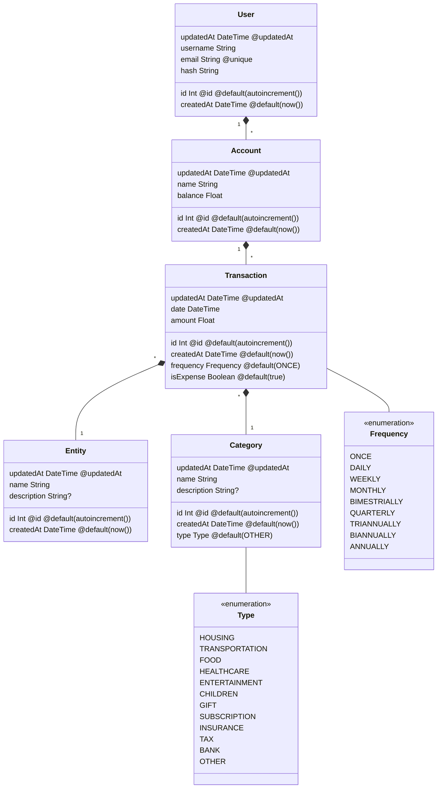

# myFloatsAPI


`myFloatsAPI` is a simple **API** to manage your budget on your accounts.

It is quite simple and straightforward, without much knowledge of accounting or business.

Here is a simple chart indicating the organization of the application:

>  NB: an `Entity` is the Source or destination of a transaction (might be a business or store, or simply a person).




---


## Endpoints

Only the `/auth/register` and `/auth/login` routes accept queries from anybody. The other routes need a **`JSON Web Token`** in the **`Authorization Header`** as a **`Bearer token`**.

No refresh token have been implemented for now, and you can change the token's `ttl` in the `/src/auth/auth.service.ts` file at line `81`:

```typescript
async signToken(userId: number, email: string): Promise<{ access_token: string }> {
        const payload = {
            sub: userId,
            email,
        };

        const token = await this.jwt.signAsync(payload, {
            expiresIn: '30m', // <- TOKEN'S TTL HERE
            secret: this.config.get('JWT_SECRET'),
        });

        return {
            access_token: token,
        };
    }
```


Here is a list of endpoints with their subsequent methods:

```yaml
"http://localhost:3000/v1":
    "/auth":
    	"/register" # POST
        "/login"	# POST
    "/users":
        "/"	# GET (view current user)
        "/"	# PATCH (update current user)
        "/"	# DELETE (delete current user)
    "/accounts":
        "/" # GET (view all accounts of the current user)
        "/" # POST (create new account)
        "/:id":
            "/" # GET (view account)
            "/" # PATCH (update account)
            "/" # DELETE (delete account)
    "/transactions/:account_id":
        "/" # GET (view all transactions of the account)
        "/" # POST (create new transaction)
        "/:id":
            "/" # GET (view transaction)
            "/" # PATCH (update transaction)
            "/" # DELETE (delete transaction)
    "/categories":
        "/" # GET (view all categories of the current user)
        "/" # POST (create new category)
        "/:id":
            "/" # GET (view category)
            "/" # PATCH (update category)
            "/" # DELETE (delete category)
    "/entities":
        "/" # GET (view all entities of the current user)
        "/" # POST (create new entity)
        "/:id":
            "/" # GET (view entity)
            "/" # PATCH (update entity)
            "/" # DELETE (delete entity)
```

> Note that the transactions are taken into account when querying the `GET /accounts/:id/` route.
> 
> Also, the *Scheduled transactions* are verified every day at 02:30 AM and they generate new transactions with a new date and the `ONCE` frequency.

All answers are in **`JSON`** format, having the result wrapped in a `data` object:

```json
{
    "data": { "result": "here" }
}
```

or a `data` array:

```json
{
    "data": [
        { "result 1": "here" },
        { "result 2": "here" }
    ]
}
```

---


## Project setup

To set the project up, you need to set your database and create your `.env` file, then install the `npm dependencies` and run the `migrations`.

You need a `PostgreSQL` server with a user having the rights to create a database.

Then, copy the `.env.example` file, name it `.env` and customize it with your own environment variables (for the database connection, only the **`DATABASE_URL`** is important).

```bash
# install the dependencies
$ npm install

# run the migrations
$ npm run prisma:dev:deploy
```

---


## Compile and run the project

```bash
# development
$ npm run start

# watch mode
$ npm run start:dev

# production mode
$ npm run start:prod
```